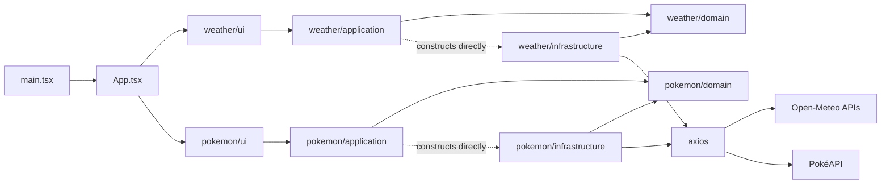

# slop-lab architecture

This document describes the application's current architecture and the boundaries it is
intended to demonstrate as the repository evolves. Each architectural problem is addressed in
its own reviewable pull request, so parts of the design are adopted and parts are still
planned; the sections below say which is which.

## Purpose and scope

slop-lab is a browser-only React application with two independent features: current weather
lookup and paginated Pokémon browsing. It is teaching material for comparing a working but
poorly separated starting point with later, focused refactors.

The project owns the browser application, its presentation logic, and its integration with
Open-Meteo and PokéAPI. It does not own either external API or a server-side component.

## Current architectural shape

Both features are split into domain, application, infrastructure, and UI layers under
`src/pokemon/` and `src/weather/`. The two features are independent: nothing under `src/` is
shared between them. [module-structure.md](module-structure.md) gives the file-level layout
and naming rules.

`main.tsx` is the browser entry point. `App.tsx` owns tab selection and renders one feature's
UI at a time; it holds no feature logic. The dotted edges are the one boundary not yet in
place: application constructs its infrastructure repository inline because no composition
root exists yet (see "Intended evolution").

## Current responsibilities and boundaries

- `main.tsx` locates the DOM root and mounts React.
- `App.tsx` renders application navigation and switches between the two feature panels.
- **Domain** owns business concepts and the ports through which a feature reaches
  infrastructure, without React, Axios, or provider response types. The ports live here, not
  in application, because domain is the stable boundary a feature exposes: other features
  that eventually depend on it should point at domain, not at application, which currently
  depends on concrete infrastructure.
- **Application** owns each feature's use cases (`getForecastUseCase`,
  `getAllPokemonDetailsUseCase`). It is the boundary through which UI obtains domain results.
- **Infrastructure** contains the HTTP adapters (`ForecastApiRepository`,
  `PokemonApiRepository`), the provider response shapes, and their mapping into domain
  models. It implements the domain-owned ports.
- **UI** (`WeatherPage.tsx`, `PokemonBrowser.tsx`) contains React rendering and interaction
  state and invokes application use cases rather than HTTP clients.
- `styles.css` supplies global presentation styles; most component styling remains inline.
- Open-Meteo and PokéAPI are public external systems reached only from infrastructure.

## Current dependencies and contracts

React and the browser DOM form the runtime UI platform. Dependency direction is inward: UI
depends on application, and application and infrastructure both depend on domain, including
the ports domain defines. Infrastructure implements those ports and does not depend on
application. Domain does not depend on React, Axios, infrastructure, or application. UI and
domain communicate through application use cases rather than depending on one another
directly.

The exception is that application depends on infrastructure, because each use case
constructs its concrete repository itself. The decision log records this as a known,
temporary violation. Infrastructure builds its data models with `class-transformer`, which
declares the fields it reads but does not validate their types, so external responses, failed requests, request timing, and
cancellation can still affect UI state directly.

## Important flows

For weather, changing the city calls `getForecastUseCase`, which geocodes the city, requests
its current conditions, and returns one located forecast for `WeatherPage` to render. Below a
minimum city-name length no search runs and the panel shows a prompt instead of a forecast.

For Pokémon, changing the offset calls `getAllPokemonDetailsUseCase`, which requests a page
from PokéAPI and then requests every listed Pokémon's detail concurrently. Filtering is
performed in memory over the current page in `PokemonBrowser.tsx`.

## Intended evolution

The four boundaries above are adopted for both features. What remains is the composition
root:

- A small **composition root** will construct the infrastructure adapters and provide them
  to the application use cases used by the UI, removing application's direct dependency on
  infrastructure. It is tracked in [issue #18](https://github.com/Mikode13/slop-lab/issues/18),
  alongside the choice of a dependency-injection library.
- Provider responses will be validated at the infrastructure boundary
  ([issue #20](https://github.com/Mikode13/slop-lab/issues/20)).

Until those land, reviewers should report the remaining coupling as known material rather
than claim an unrelated change caused it.

## Constraints and trade-offs

- Architectural improvements must remain small enough for each pull request to demonstrate
  one problem and the value of its fix.
- Known missing validation, request cancellation, error states, shared request logic, and
  tests beyond the unit boundary are deliberate starting conditions and must not be repaired
  opportunistically.
- The application remains browser-only unless a later project decision explicitly adds a
  server-side responsibility.
- The intended layers should contain meaningful policy or integration boundaries. Empty
  folders and pass-through abstractions would hide rather than teach the design.
