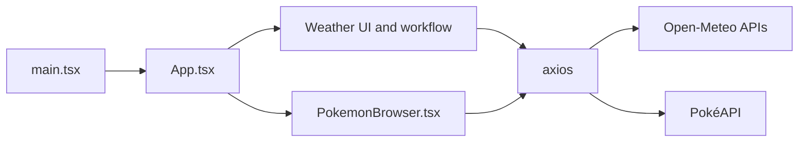
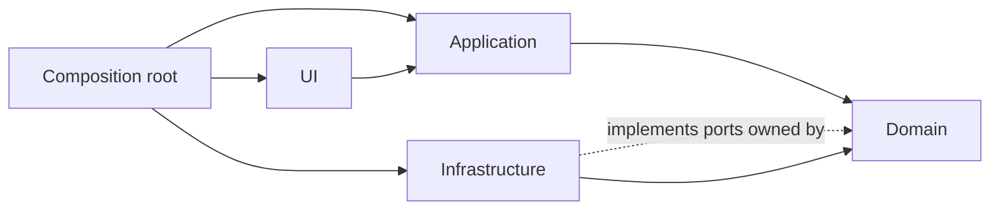

# slop-lab architecture

This document describes the application's current architecture and the boundaries it is
intended to demonstrate as the repository evolves. The current code is deliberately less
structured than the intended design; each architectural problem is addressed in its own
reviewable pull request.

## Purpose and scope

slop-lab is a browser-only React application with two independent features: current weather
lookup and paginated Pokémon browsing. It is teaching material for comparing a working but
poorly separated starting point with later, focused refactors.

The project owns the browser application, its presentation logic, and its integration with
Open-Meteo and PokéAPI. It does not own either external API or a server-side component.

## Current architectural shape

The application currently has a deliberately flat `src/` directory. React components own
rendering, interaction state, use-case orchestration, HTTP requests, external response types,
and conversion of remote data into displayed values.

`main.tsx` is the browser entry point. `App.tsx` owns tab selection and the complete weather
flow. `PokemonBrowser.tsx` owns the complete Pokémon flow. There is no separate domain,
application, or infrastructure implementation yet.

## Current responsibilities and boundaries

- `main.tsx` locates the DOM root and mounts React.
- `App.tsx` renders application navigation and weather UI, geocodes city text, requests
  current weather, stores the results, and translates weather codes for display.
- `PokemonBrowser.tsx` renders filtering and pagination, requests each page and its details,
  stores remote response objects, and maps Pokémon types to presentation colours.
- `styles.css` supplies global presentation styles; most component styling remains inline.
- Open-Meteo and PokéAPI are public external systems reached directly from React effects.

The component boundary between `App` and `PokemonBrowser` separates the two visible
features, but it is not an architectural boundary: both components independently combine
presentation, orchestration, and infrastructure concerns.

## Current dependencies and contracts

React and the browser DOM form the runtime UI platform. Both feature components depend
directly on Axios and on the external APIs' URL and response shapes. The TypeScript response
interfaces are local assertions, not runtime-validated contracts.

No project-owned interface separates the features from HTTP or the providers. External
responses, failed requests, request timing, and cancellation can therefore affect component
state directly.

## Important flows

For weather, changing the city triggers an Open-Meteo geocoding request. A selected result
updates coordinates, which triggers a second request for current conditions. The component
then translates the weather code and renders the values.

For Pokémon, changing the offset requests a page from PokéAPI and then requests every
listed Pokémon concurrently. Filtering is performed in memory over the current page.

## Intended evolution

The project will evolve towards four explicit boundaries through separate pull requests:

- **Domain** will own business concepts, pure rules, and the ports through which the
  feature reaches infrastructure, without React, Axios, or provider response types. The
  ports live here, not in application, because domain is the stable boundary a feature
  exposes: other features that eventually depend on it should point at domain, not at
  application, which is already allowed to depend on concrete infrastructure.
- **Application** will own the weather and Pokémon use cases. It will be the boundary
  through which UI obtains domain results, coordinating domain concepts through the ports
  domain defines.
- **Infrastructure** will contain HTTP adapters, provider-specific response validation, and
  mapping into project-owned domain values. It will implement domain-owned ports.
- **UI** will contain React rendering and interaction state. It will invoke application use
  cases rather than HTTP clients.
- A small **composition root** will construct the infrastructure adapters and provide them
  to the application use cases used by the UI.

Dependency direction is inward: UI depends on application contracts, and application and
infrastructure both depend on domain concepts, including the ports domain defines for
external data access. Infrastructure implements those ports; it does not depend on
application. Domain does not depend on React, Axios, infrastructure, or application. UI and
domain communicate through application use cases rather than by depending directly on one
another.

This structure is a direction for the teaching sequence, not the current implementation.
Until a focused pull request introduces a boundary, reviewers should report the existing
coupling as known, pre-existing material rather than claim that an unrelated change caused
it.

## Constraints and trade-offs

- Architectural improvements must remain small enough for each pull request to demonstrate
  one problem and the value of its fix.
- Known missing validation, request cancellation, error states, shared request logic, and
  tests are deliberate starting conditions and must not be repaired opportunistically.
- The application remains browser-only unless a later project decision explicitly adds a
  server-side responsibility.
- The intended layers should contain meaningful policy or integration boundaries. Empty
  folders and pass-through abstractions would hide rather than teach the design.
